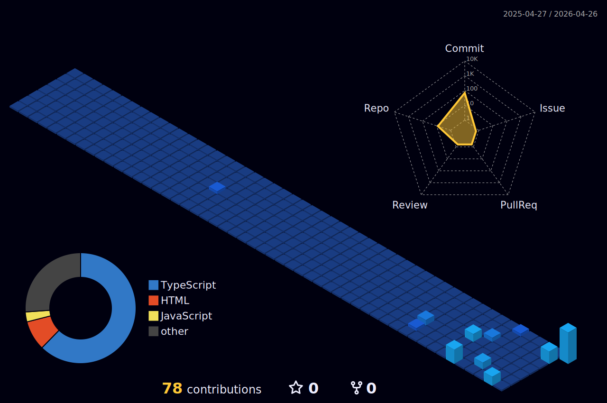

<!-- Banner -->

  

 

<h1 align="left">
  
  Hi, I'm <strong>Shreeharsh Patil</strong>
</h1>

<h3>C • Python • C++ • Js • Html • Css</h3>

  

  

    I'm a developer who loves turning ideas into smooth, functional, and visually engaging digital experiences.  
    From sleek UIs, I build digital products that feel fast, intuitive, and enjoyable.
  

  

    
    
    
    
  

<h3>🌐 Socials</h3>
  

  

  

  

  

  

  

  

  <!-- Visitor Counter -->
  

 

<h3 align="center">📊 My GitHub Activity</h3>

  

  

 

## 🛠️ Skills

<table align="center" width="100%">
<tr>
<td width="50%" align="center">
<h3>💻 Programming Languages</h3>

 
  

</td>

<td width="50%" align="center">
   <h3>📚 Frameworks & Libraries</h3>

</td>

</tr>
<tr>
<td width="50%" align="center">
  <h3>🗄️ Databases</h3>
    
  

</td>

<td width="50%" align="center">
    <h3>🧰 Tools & Platforms</h3>
    
</td>
</tr>
</table>

## 📊 GitHub Stats

   
  
   
  

---

## ❤️ Support Me

  

