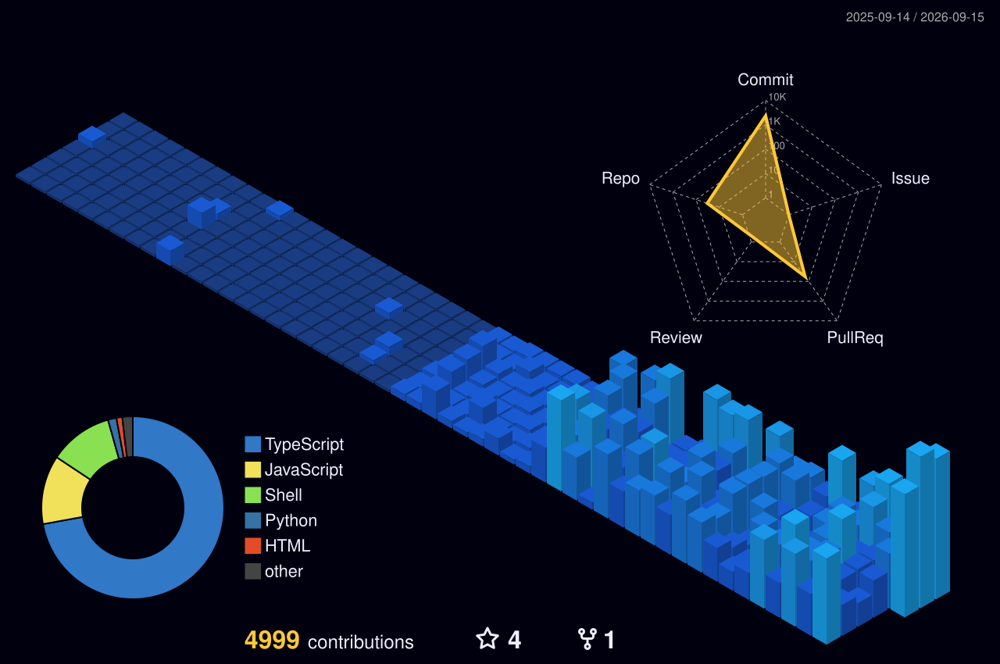

<!-- Banner -->

  

 

  

  

  

    
  

  

    I'm a developer who loves turning ideas into smooth, functional, and visually engaging digital experiences.
    From sleek UIs to full-stack applications, I build digital products that feel fast, intuitive, and enjoyable.
  

  

    
    
  

<h3>🌐 Socials</h3>

  

  

  

  

  

 
 

 

<h3 align="center">📊 My GitHub Activity</h3>

  

  

 

<h2 align="center">🐍 Contribution Snake</h2>

<picture>
  <source media="(prefers-color-scheme: dark)" srcset="https://raw.githubusercontent.com/shreeharsh-patil/shreeharsh-patil/output/github-snake-dark.svg" />
  <source media="(prefers-color-scheme: light)" srcset="https://raw.githubusercontent.com/shreeharsh-patil/shreeharsh-patil/output/github-snake.svg" />
  
</picture>

 

## 🛠️ Skills

<table align="center" width="100%">

<tr>

<td width="50%" align="center">

<h3>💻 Programming Languages</h3>

  

</td>

<td width="50%" align="center">

<h3>⚛️ Frameworks & Libraries</h3>

  

</td>

</tr>

<tr>

<td width="50%" align="center">

<h3>🗄️ Databases</h3>

</td>

<td width="50%" align="center">

<h3>🧰 Tools & Platforms</h3>

  

</td>

</tr>

</table>

 

## 📊 GitHub Stats

   

  

    

 

  

  

